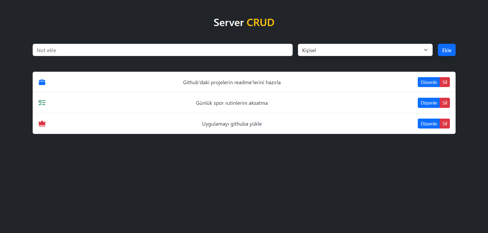

# Basit Todo Uygulaması

Bu proje, React kullanılarak oluşturulmuş, JSON-server ile bir API üzerinden todo verilerinin yönetildiği basit bir todo uygulamasıdır. Görevler eklenip, düzenlenip, silinebilir. Uygulama Axios ile API istekleri atmakta, stil düzenlemeleri için Bootstrap, bildirimler için Toastify, ve simgeler için React Icons kullanmaktadır.

## Özellikler

- **Todo Ekleme:** Yeni görev ekleyebilme.
- **Todo Düzenleme:** Mevcut görevleri güncelleyebilme.
- **Todo Silme:** Görevleri silme.
- **Bildirimler:** Toastify ile başarı ve hata bildirimleri.
- **JSON-server:** Yerel bir API ile veri yönetimi.

## Proje Kurulumu

Projeyi yerel ortamınızda çalıştırmak için aşağıdaki adımları izleyin:

1. Projeyi klonlayın:

   ```bash
   git clone https://github.com/cengo14/react-json-server-crud-example-project.git
   ```

2. Proje dizinine gidin:

   ```bash
   cd react-json-server-crud-example-project
   ```

3. Gerekli bağımlılıkları yükleyin:

   ```bash
   npm install
   ```

4. JSON-server'ı başlatın (API servisi):

   ```bash
   npm run server
   ```

5. Uygulamayı başlatın:

   ```bash
   npm run dev
   ```

## Kullanılan Teknolojiler

- **React** - UI oluşturmak için
- **JSON-server** - Yerel API servisi sağlamak için
- **Axios** - API istekleri için
- **Bootstrap** - Stil düzenlemeleri için
- **React Toastify** - Bildirimler için
- **React Icons** - Simgeler için

## Ekran Görüntüleri

### Anasayfa



## Katkıda Bulunma

Katkıda bulunmak isterseniz, pull request açabilir veya issue oluşturabilirsiniz.

